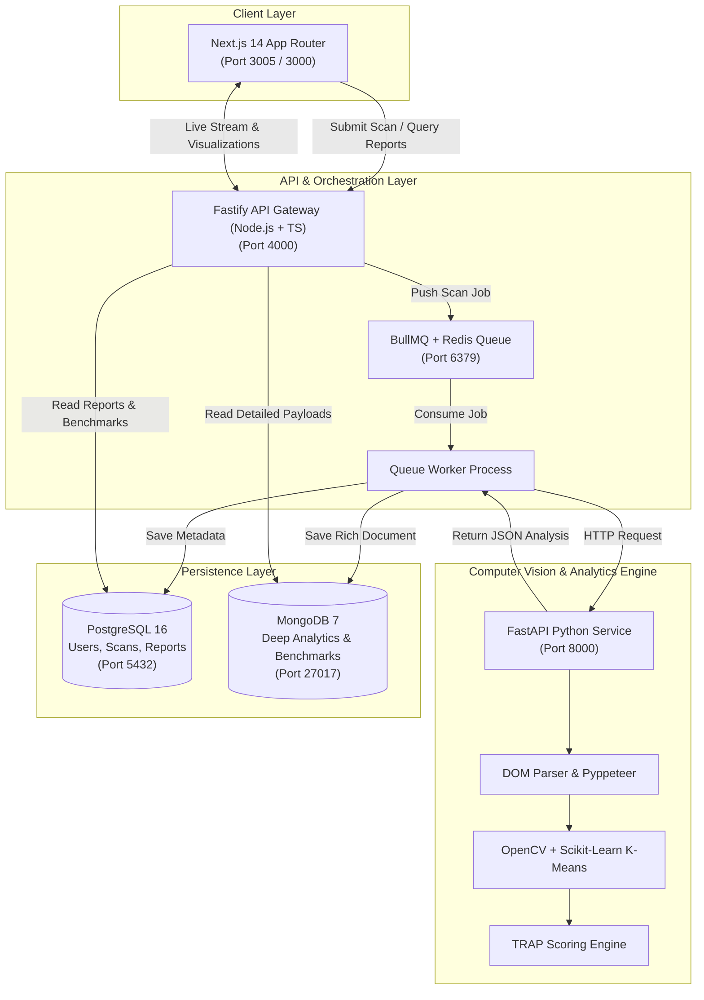

<div align="center">

# ⚡ TRAP UI
### **Trend Research & Analytics Platform for User Interfaces**

An enterprise-grade, multi-service intelligence platform that autonomously scans, parses, benchmarks, and scores web interfaces—delivering actionable UX diagnostics and instant "Target 100" UI blueprints.

[](https://nextjs.org/)
[](https://www.fastify.io/)
[](https://fastapi.tiangolo.com/)
[](https://opencv.org/)
[](https://scikit-learn.org/)
[](https://www.docker.com/)
[](LICENSE)

[Features](#-key-features) • [Architecture](#-system-architecture) • [Scoring Engine](#-trap-ui-scoring-model) • [Quick Start](#-quick-start) • [API Reference](#-api-endpoints) • [Monorepo Structure](#-repository-structure)

---

</div>

## 📌 Overview

Evaluating a modern web application's user interface, conversion readiness, contrast compliance, and layout density has traditionally been manual, subjective, and disjointed.

**TRAP UI** solves this by providing a unified pipeline:
1. **Headless Ingestion**: Takes any public URL, runs safety & compliance checks (`robots.txt`, login-wall detection), and captures high-fidelity full-page and above-the-fold screenshots.
2. **Computer Vision & DOM Extraction**: Uses OpenCV and Scikit-Learn K-Means clustering to identify dominant palettes, calculates WCAG contrast ratios, counts/ranks CTAs, and measures information density.
3. **TRAP UI 0–100 Weighted Scoring**: Evaluates the page across 5 weighted vectors with industry-tuned penalty curves (FinTech, AI SaaS, EdTech).
4. **Design Intelligence v2 & Instant UI Generator**: Diagnoses point loss, identifies design archetypes, and synthesizes a production-grade "Target 100" UI blueprint with copy-ready Tailwind React code.

---

## ✨ Key Features

### 🔍 Automated Headless URL Scanner
- **Dual Screenshot Engine**: Captures full-page viewport and above-the-fold hero rendering using headless Chromium.
- **Safety & Compliance Guards**: Checks `robots.txt`, rejects private/internal IPs, and flags login walls or paywalls.
- **Auto-Cleanup**: Background rotation and cleanup of screenshot artifacts.

### 🎨 Computer Vision & DOM Intelligence
- **K-Means Color Clustering ($k=5$)**: Extracts brand palette, identifies background/surface/accent shades, and computes contrast ratios against WCAG 2.1 AA/AAA baselines.
- **CTA Detection & Hierarchy**: Classifies primary, secondary, and ghost action buttons, assessing visibility, prominence, and above-the-fold presence.
- **DOM Density & Layout Classifier**: Distinguishes between Split Hero, Centered Hero, Sidebar Nav, Dashboard, and Card Grid layouts while computing content density.

### 📊 Objective TRAP UI Scoring Engine (0–100)
- Weighted multi-vector algorithm designed to evaluate trust, layout efficiency, and conversion potential.
- Dynamic penalty adjustments tailored for **FinTech** (trust & contrast priority), **AI SaaS** (modern layout & conversion speed), and **EdTech** (clarity & cognitive load).

### 🧠 TRAP Design Intelligence v2
- **Design Archetyping**: Maps interfaces to design systems (*Corporate Trust*, *SaaS Clean*, *Glass Lux*, *Cyber Dim*, *Luxury Minimal*).
- **Score Gap Diagnostics**: Itemizes exact metric deficiencies, lost points, severity levels, and remedial guidance.
- **Actionable Improvement Roadmap**: Categorizes recommended enhancements into phased tasks with projected score gains.

### ⚡ Instant "Target 100" UI Blueprint Generator
- Generates an optimized, accessible blueprint engineered to achieve a perfect 100 score.
- Outputs semantic design tokens, section hierarchy, CTA strategies, and **copy-ready React (Tailwind CSS)** and standalone HTML components.

### 📈 Industry Benchmarks & Interactive Dashboard
- Real-time comparison against aggregated industry baselines.
- Interactive radar charts, score distribution bars, live scan preview, and historical report inspection built with Next.js 14, Recharts, and Framer Motion.

---

## 🏗 System Architecture

TRAP UI is architected as an event-driven, decoupled microservices monorepo:



---

## 📐 TRAP UI Scoring Model

The TRAP UI Score ($0 - 100$) is computed from 5 normalized metric vectors ($0 - 10$ each):

$$\text{TRAP Score} = 10 \times \sum_{i=1}^{5} (w_i \times M_i)$$

| Metric Dimension | Weight ($w_i$) | Focus Area |
|:-----------------|:--------------:|:-----------|
| **Layout Efficiency** | `25%` (0.25) | Structural alignment, viewport hierarchy, and reading flow |
| **CTA Optimization** | `25%` (0.25) | Prominence, above-the-fold placement, and quantity balance |
| **Color Trust Index** | `20%` (0.20) | WCAG contrast compliance, brand color cohesion, and readability |
| **Conversion Indicators**| `20%` (0.20) | Visual urgency, social proof anchors, and form accessibility |
| **Mobile Responsiveness** | `10%` (0.10) | Viewport adaptability, touch target safety, and density control |

### Industry Penalty Matrix
- **FinTech**: Contrast ratio $< 4.5:1$ applies a $0.80\times$ penalty to Color Trust; 0 CTAs applies a $0.70\times$ penalty.
- **AI SaaS**: Non-hero layouts (e.g. cluttered sidebars or dense tables) receive a $0.90\times$ layout penalty.
- **EdTech**: High-density layouts receive a $0.85\times$ penalty to enforce cognitive clarity and ease of navigation.

---

## 📂 Repository Structure

```text
.
├── docker-compose.yml           # Unified multi-container deployment
├── start.sh                     # Zero-config Docker startup script with socket discovery
├── start_local.sh               # Local development runner (runs all 3 services natively)
├── README.md                    # Project documentation
│
├── trap-ui-frontend/            # Next.js 14 App Router + TailwindCSS + Recharts
│   ├── app/                     # App router pages (dashboard, analyze, reports, auth)
│   ├── components/              # UI components (AnalyzeConsole, DashboardView, etc.)
│   ├── lib/                     # API client and session management
│   └── types/                   # TypeScript interfaces
│
├── trap-ui-backend/             # Fastify + TypeScript API Gateway & Queue Engine
│   ├── src/controllers/         # Scan, report, and auth controllers
│   ├── src/routes/              # REST route definitions
│   ├── src/services/            # Prediction engine, UI generator, DB connections
│   ├── src/queue/               # BullMQ scan queue and async worker
│   ├── db/schema.sql            # PostgreSQL relational schema
│   └── docs/API.md              # Detailed API endpoint reference
│
└── trap-ui-analytics/           # Python 3 FastAPI + Computer Vision Service
    ├── app/main.py              # FastAPI endpoints
    ├── app/services/            # Color clustering, CTA detector, DOM parser, scoring
    └── tests/                   # Pytest suites for scoring and analysis pipelines
```

---

## 🚀 Quick Start

### Option 1: Docker Compose (Recommended)

Run everything (Frontend, Backend, Analytics, PostgreSQL, MongoDB, Redis) with a single command:

```bash
chmod +x start.sh
./start.sh
```

Or using standard `docker compose`:

```bash
docker compose up --build
```

#### Service Endpoints:
- 🌐 **Frontend**: [http://localhost:3005](http://localhost:3005)
- 🔌 **Backend API**: [http://localhost:4000](http://localhost:4000)
- 🧠 **Analytics Engine**: [http://localhost:8000](http://localhost:8000)
- 🐘 **PostgreSQL**: `localhost:5432`
- 🍃 **MongoDB**: `localhost:27017`
- ⚡ **Redis**: `localhost:6379`

---

### Option 2: Local Development (Without Docker)

You can run the entire stack locally using `./start_local.sh` or run each service independently:

#### 1. Start Analytics Service (FastAPI)
```bash
cd trap-ui-analytics
python3 -m venv .venv
source .venv/bin/activate
pip install -r requirements.txt
uvicorn app.main:app --reload --port 8000
```

#### 2. Start Backend Service (Fastify)
```bash
cd trap-ui-backend
npm install
cp .env.example .env
npm run build
npm run dev
```

#### 3. Start Frontend Service (Next.js)
```bash
cd trap-ui-frontend
npm install
npm run dev
```

---

## 📡 API Endpoints

Base URL: `http://localhost:4000`

### Authentication
| Method | Endpoint | Description |
|:-------|:---------|:------------|
| `POST` | `/api/auth/register` | Register new account (`name`, `email`, `password`, `plan`) |
| `POST` | `/api/auth/login` | Authenticate and obtain JWT token |
| `GET`  | `/api/auth/me` | Fetch authenticated user profile & remaining quota |

### Scanning & Analysis
| Method | Endpoint | Description |
|:-------|:---------|:------------|
| `POST` | `/api/scan` | Submit URL for analysis (`url`, `industryTag`) |
| `GET`  | `/api/scan/:id` | Poll status of an in-progress scan job |

### Reports & Benchmarks
| Method | Endpoint | Description |
|:-------|:---------|:------------|
| `GET`  | `/api/reports` | List scan reports for authenticated user |
| `GET`  | `/api/reports/:id` | Fetch full report with score breakdown & target blueprint |
| `GET`  | `/api/admin/reports`| List all platform reports (*admin role required*) |
| `GET`  | `/api/benchmarks` | Retrieve industry benchmark averages |

For full request/response schemas, see [trap-ui-backend/docs/API.md](trap-ui-backend/docs/API.md).

---

## 🧪 Testing

### Backend Unit & Integration Tests
```bash
cd trap-ui-backend
npm test
```
Tests cover score calculations, URL validation guards, robots.txt handlers, and UI generator synthesis.

### Analytics Service Tests
```bash
cd trap-ui-analytics
pytest -q
```
Tests cover DOM parsing, color extraction, contrast calculations, and score engine tolerances.

---

## 🛡 Security & Best Practices

- **Sandboxed Scraping**: Headless browser runs under isolated worker contexts with resource budgets.
- **SSRF Prevention**: Scan targets are validated to block private, loopback, and cloud metadata IPs (`127.0.0.1`, `169.254.169.254`, etc.).
- **Rate Limiting**: Built-in rate limiting per IP and JWT token to protect against scraping abuse.
- **Compliance First**: Automated inspection of `robots.txt` before executing page crawls.

---

## 📄 License

This project is licensed under the MIT License - see the [LICENSE](LICENSE) file for details.
